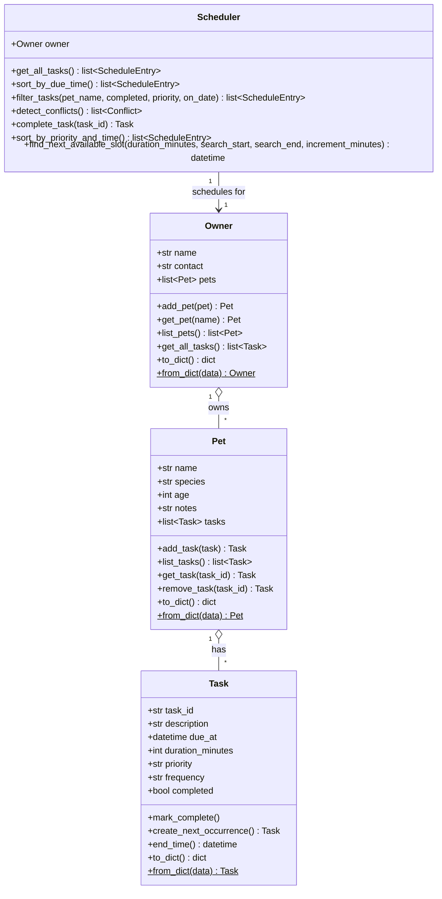

# 🐾 PawPal+

A pet-care planning assistant. PawPal+ helps a busy owner organize care tasks
across **multiple pets**, sort them chronologically or by priority, catch
scheduling conflicts, handle recurring tasks, and find open time slots — all
backed by a small, well-tested object-oriented engine and exposed through both
a CLI demo and a Streamlit app.

---

## 1. Project Overview

PawPal+ models the real problem of keeping pet care consistent. An owner adds
their pets, schedules care tasks (walks, feeding, medication, grooming, vet
visits), and PawPal+ turns that into an organized, conflict-aware daily plan.

The scheduling logic lives in a single framework-agnostic module
([pawpal_system.py](pawpal_system.py)) so the *same* code powers the CLI demo,
the Streamlit UI, and the test suite.

## 2. User Problem and Three Core User Actions

> *A busy pet owner struggles to stay consistent with care across several pets
> and wants one place to plan the day.*

The three core user actions are:

1. **Add pets** — register one or more pets with species, age, and care notes.
2. **Schedule care tasks** — add tasks with a due time, duration, priority, and
   recurrence (once / daily / weekly).
3. **View an organized plan** — see all tasks across pets sorted by time or
   priority, with conflicts flagged and free slots suggested.

## 3. Architecture

```
pawpal_system.py   ← domain model + Scheduler + JSON persistence (no UI code)
       ▲                      ▲                         ▲
       │                      │                         │
   main.py (CLI)        app.py (Streamlit)      tests/test_pawpal.py
```

The engine never imports Streamlit, and the UI never re-implements scheduling
logic — it only calls engine methods. This keeps the business rules in one
place and makes them directly testable.

## 4. Owner, Pet, Task, and Scheduler

| Class | Responsibility | Key attributes | Key methods |
|-------|----------------|----------------|-------------|
| **Task** | One care task occupying `[due_at, due_at + duration)` | `task_id`, `description`, `due_at`, `duration_minutes`, `priority`, `frequency`, `completed` | `mark_complete()`, `create_next_occurrence()`, `end_time()`, `overlaps()`, `to_dict()`/`from_dict()` |
| **Pet** | Owns a collection of tasks | `name`, `species`, `age`, `notes`, `tasks` | `add_task()`, `list_tasks()`, `get_task()`, `remove_task()`, `to_dict()`/`from_dict()` |
| **Owner** | Has many pets | `name`, `contact`, `pets` | `add_pet()`, `get_pet()`, `list_pets()`, `get_all_tasks()`, `to_dict()`/`from_dict()` |
| **Scheduler** | Reasons about tasks **across all pets** | `owner` | `get_all_tasks()`, `sort_by_due_time()`, `filter_tasks()`, `detect_conflicts()`, `complete_task()`, `sort_by_priority_and_time()`, `find_next_available_slot()` |

The relationship is **Owner → many Pets → many Tasks**. The Scheduler holds a
reference to the Owner and reads tasks live from every pet, so it always
operates across the whole household, never a single pet.

Scheduler queries return a small **`ScheduleEntry(pet, task)`** record so the
caller always knows which pet a task belongs to when tasks from several pets
are merged. Conflicts are returned as **`Conflict(first, second, overlap_start,
overlap_end)`** records.

## 5. Mermaid UML Reference

The authoritative diagram is [diagrams/uml_final.mmd](diagrams/uml_final.mmd)
(the initial sketch is [diagrams/uml_draft.mmd](diagrams/uml_draft.mmd)).



## 6. Required Scheduling Algorithms

| Capability | Method | What it does |
|------------|--------|--------------|
| Chronological sorting | `Scheduler.sort_by_due_time()` | Sorts every task across all pets by real `datetime`, deterministically; never mutates the pets' lists. |
| Filtering | `Scheduler.filter_tasks(pet_name, completed, priority, on_date)` | Combines criteria with AND across all pets. |
| Conflict detection | `Scheduler.detect_conflicts()` | Flags any two tasks whose `[due_at, end_time)` ranges overlap (duration-based, not exact-timestamp), including across different pets. Returns structured `Conflict` records. |
| Recurring tasks | `Task.create_next_occurrence()` + `Scheduler.complete_task()` | Completing a daily/weekly task marks it done and spawns one new incomplete occurrence (+1 day / +7 days) on the same pet. Idempotent: completing twice never duplicates. |

## 7. Advanced Scheduling Features (Stretch)

| Capability | Method | What it does |
|------------|--------|--------------|
| Priority-first scheduling | `Scheduler.sort_by_priority_and_time()` | Orders high → medium → low, then chronologically within a priority, across all pets. |
| Next available slot | `Scheduler.find_next_available_slot(duration, start, end, increment=15)` | Scans a window in 15-minute steps and returns the earliest start time whose range overlaps no *incomplete* task across any pet, or `None` if the window is full. |

## 8. JSON Persistence

Implemented with the standard-library `json` module in
[pawpal_system.py](pawpal_system.py):

- **`save_to_json(owner, path)`** — writes the full Owner → Pets → Tasks tree to
  a JSON file. Datetimes are stored as ISO 8601 strings; completion status,
  frequency, priority, duration, and stable `task_id`s are all preserved.
- **`load_from_json(path)`** — reads a save file and reconstructs real `Owner`,
  `Pet`, and `Task` objects. A missing file raises `FileNotFoundError` with a
  clear message; malformed or wrong-shaped JSON raises `ValueError`.

The round trip is verified by `test_json_round_trip_preserves_everything`. The
Streamlit app exposes this as **Download owner JSON** / **Load owner JSON**, and
the CLI demo performs a save/load round trip in a temporary directory. No
personal runtime data is committed to the repo.

## 9. Professional CLI and Streamlit Formatting

- **CLI** ([main.py](main.py)): standard-library only. Section headings, an
  aligned column formatter (`format_table`), priority icons (🔴🟡🟢), and
  status icons (✅ / ⬜). No formatting dependency is added.
- **Streamlit** ([app.py](app.py)): tabbed layout (Add Task / All Tasks / Smart
  Scheduling), `st.dataframe` tables, sidebar for owner/pet/persistence/reset,
  and `st.success` / `st.info` / `st.warning` / `st.error` feedback. Reset
  requires an explicit confirmation checkbox.

## 10. Project Structure

```
pawpal-plus/
├── pawpal_system.py        # Domain model, Scheduler, JSON persistence
├── main.py                 # CLI demonstration
├── app.py                  # Streamlit interface
├── tests/
│   └── test_pawpal.py      # 44-case pytest suite
├── diagrams/
│   ├── uml_draft.mmd       # Initial design sketch
│   ├── uml_final.mmd       # Final design (matches the code)
│   └── uml.mmd             # Legacy pointer to the two diagrams above
├── demo_output.txt         # Captured `python main.py` output
├── test_results.txt        # Captured `pytest -v` output
├── requirements.txt
├── README.md
├── reflection.md
└── ai_interactions.md
```

## 11. Setup

```bash
python -m venv .venv
source .venv/bin/activate          # Windows: .venv\Scripts\activate
pip install -r requirements.txt
```

Requires Python 3.12. Dependencies: `streamlit` (UI) and `pytest` (tests). The
engine itself uses only the standard library.

## 12. Run the CLI Demo

```bash
python main.py
# Save a fresh capture:
python main.py | tee demo_output.txt
```

## 13. Run Streamlit

```bash
python -m streamlit run app.py
```

## 14. Run Tests

```bash
python -m compileall pawpal_system.py main.py app.py tests
PYTEST_DISABLE_PLUGIN_AUTOLOAD=1 python -m pytest -v
# Save a fresh capture:
python -m pytest -v | tee test_results.txt
```

## 15. Demo Walkthrough

1. Launch the app with `python -m streamlit run app.py`.
2. In the sidebar, set the **owner** name/contact and **add at least two pets**.
3. Open the **Add Task** tab and schedule several tasks with different dates,
   times, durations, priorities, and frequencies (include a daily/weekly one).
4. Open the **All Tasks** tab to view every task across pets; use the pet /
   priority / status filters, then mark a task complete (a recurring task
   spawns its next occurrence).
5. Open the **Smart Scheduling** tab to see the chronological plan, the
   priority-first plan, any conflict warnings, and the next-available-slot
   finder. Use the sidebar to **download** the plan as JSON, **load** it back,
   or **reset** the session (with confirmation).

**Screenshot or video** *(optional)*: <!-- add a link if you record one -->

## 16. Real CLI Output (`python main.py`)

Captured verbatim (full output in [demo_output.txt](demo_output.txt)):

```text
================================================================
  3. Chronological Sorting (across all pets)
================================================================

Sorted by due time:
When             Dur  Priority  Freq    Pet      Task             Status
----------------+-----+----------+--------+---------+-----------------+-------
Wed 07-01 08:00  30m  🔴 high    daily   Mochi    Morning walk     ⬜ open
Wed 07-01 08:15  45m  🟢 low     weekly  Mochi    Bath             ⬜ open
Wed 07-01 08:20  10m  🔴 high    daily   Biscuit  Give medication  ⬜ open
Wed 07-01 12:00  20m  🟡 medium  once    Biscuit  Brush coat       ⬜ open
Wed 07-01 18:00  30m  🔴 high    daily   Mochi    Evening walk     ⬜ open

================================================================
  5. Conflict Detection (duration-based overlap)
================================================================
   ⚠️  Mochi's 'Morning walk' overlaps Mochi's 'Bath' (2026-07-01 08:15–08:30)
   ⚠️  Mochi's 'Morning walk' overlaps Biscuit's 'Give medication' (2026-07-01 08:20–08:30)
   ⚠️  Mochi's 'Bath' overlaps Biscuit's 'Give medication' (2026-07-01 08:20–08:30)

================================================================
  6. Priority-First Scheduling
================================================================

Sorted by priority (high→low), then time:
When             Dur  Priority  Freq    Pet      Task             Status
----------------+-----+----------+--------+---------+-----------------+-------
Wed 07-01 08:00  30m  🔴 high    daily   Mochi    Morning walk     ⬜ open
Wed 07-01 08:20  10m  🔴 high    daily   Biscuit  Give medication  ⬜ open
Wed 07-01 18:00  30m  🔴 high    daily   Mochi    Evening walk     ⬜ open
Wed 07-01 12:00  20m  🟡 medium  once    Biscuit  Brush coat       ⬜ open
Wed 07-01 08:15  45m  🟢 low     weekly  Mochi    Bath             ⬜ open

================================================================
  7. Recurring-Task Completion
================================================================
Completing Mochi's daily task: 'Morning walk' (07-01 08:00)
   ↪ next occurrence created: 'Morning walk' on Thu 07-02 08:00 (completed=False)
Calling complete_task again on the same id (idempotency check):
   ↪ returned None — no duplicate recurrence created.

================================================================
  8. Next Available Slot
================================================================
   📅 Earliest free 60-minute slot between 08:00 and 20:00: Wed 07-01 09:00
```

## 17. Real Passing Test Output

Excerpted from the captured run (complete, unedited log in [test_results.txt](test_results.txt)):

```text
============================= test session starts ==============================
platform darwin -- Python 3.12.1, pytest-9.1.1, pluggy-1.6.0
collected 44 items

tests/test_pawpal.py::test_task_creation_sets_fields PASSED              [  2%]
tests/test_pawpal.py::test_task_end_time PASSED                          [  4%]
tests/test_pawpal.py::test_task_completion_changes_status PASSED         [  6%]
...
tests/test_pawpal.py::test_owner_with_no_pets_has_no_tasks PASSED        [ 97%]
tests/test_pawpal.py::test_pet_with_no_tasks PASSED                      [100%]

============================== 44 passed in 0.05s ==============================
```

## 18. Test Coverage Summary

44 tests across these areas:

- **Core classes** — task creation/completion, pet task add/get/remove, owner
  pet add/get, multi-pet task collection.
- **Required algorithms** — chronological sort (and non-mutation), filtering by
  pet/status/priority and combinations, exact + partial overlap conflicts, no
  false positive for adjacent tasks.
- **Recurrence** — daily (+1 day), weekly (+7 days), once does not recur,
  completion spawns on the same pet, double-completion is idempotent.
- **Stretch** — priority-first ordering and tie-break, next-slot in open /
  occupied / full windows, completed tasks don't block slots, JSON round trip.
- **Validation / edge cases** — invalid priority/frequency, zero/negative
  duration, empty description/owner name, owner with no pets, pet with no
  tasks, missing / malformed / wrong-shaped save files.

## 19. Confidence Level

**★★★★☆ (4 / 5).** Every feature is exercised by a deterministic test and a
real CLI run, and the Streamlit app passes a headless boot smoke test. One star
is held back because UI interactions were verified by a headless boot + manual
reasoning rather than an automated browser test, and the scheduler does not yet
model multi-day calendars or travel time between appointments.

## 20. Limitations and Future Improvements

- Conflicts are detected by calendar overlap only — no travel/transition time
  between appointments is modeled.
- `find_next_available_slot` searches a single contiguous window in fixed
  15-minute increments; it does not span days or align to existing gaps
  adaptively.
- No notion of recurring-task *end dates* — recurrence is open-ended.
- Persistence is single-owner per file; there is no multi-owner database.
- Future: per-pet calendars, reminders/notifications, drag-to-reschedule UI,
  and configurable slot granularity.

## 21. AI Collaboration Summary

Planning and implementation were split across two tools. **ChatGPT** was used
for rubric-first planning — mapping every grading requirement to files,
methods, tests, evidence, and commits. **Claude Code** performed the
repository-aware implementation: inspecting the actual starter files,
writing the engine/CLI/UI/tests, running them, and reviewing diffs before each
commit. All AI output was treated as a proposal and verified by running the
test suite and the CLI, booting Streamlit, and reading diffs. Full detail is in
[ai_interactions.md](ai_interactions.md) and [reflection.md](reflection.md).
```
